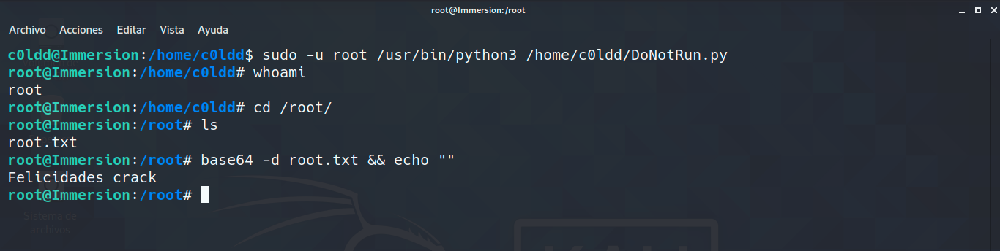

# IMMERSION
### COLDDWORLD series
*write up de la siguiente*
## [maquina de Vulnhub](https://www.vulnhub.com/entry/colddworld-immersion,668/)

---

## Port scan
#	`nmap -sV -p- <ip-victima> `

El *escaneo de puertos* muestra **2 servicios** que parecen ser un **http** en el clasico **puerto 80** y un **ssh** pero en un **puerto poco comun**, el **3042**, hydra podria ayudarnos a probar fuerza bruta en el ssh pero primero veamos que encontramos en el http

## Dir fuzz
#	`dirb http://<ip-http> `

Buscando directorios, mediante algunas de las muchas herramientas que existes (*gobuster, dirb, wfuzz*) nos encontramos rapidamente y sin muchas vueltas con la pagina de login, entre otras

vamos al **codigo fuente**

introducimos cualquier username y password

presten atencion al url y la manera en como parsea el php, nos podria dejar ver archivos como el de carls.txt

ya tenemos un usuario y una contraseña, el mejor lugar para ir a probar es ese puerto ssh que encontramos en el escaneo

#	`ssh -p 3042 carls@<ip-victima> `

## Ya estamos adentro
Ahora veamos que podemos hacer mediante la busqueda de permisos mal configurados
[basic linux privilege escalation](https://blog.g0tmi1k.com/2011/08/basic-linux-privilege-escalation/)
[suid executables](https://pentestlab.blog/2017/09/25/suid-executables/)
al final el truco estaba en el siempre usado
#	`sudo -l`

#	`sudo -u c0ldd /bin/bash`

vallamos a la primer flag

## Naciendo como Root
Veamos ese fichero python, editemos ese ejecutable para que nos de una shell, tendria que quedar asi

#	`sudo -u root /usr/bin/python3 /home/c0ldd/DoNotRun.py`

y ya tenemos la flag del root, **maquinita terminada**